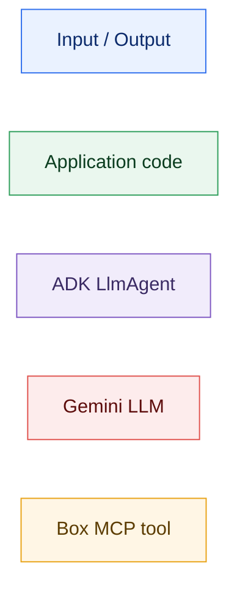
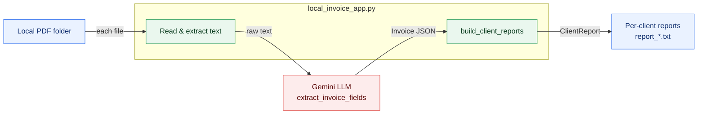
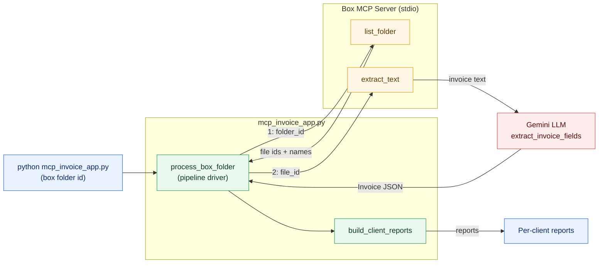
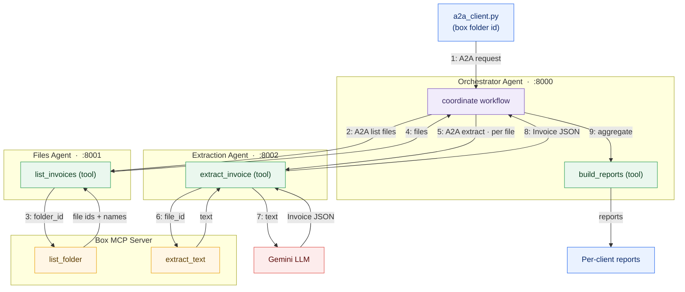

# Multi-Agent MCP PDF Invoice Data Extractor

Three progressively more capable apps that extract structured data from PDF
invoices — invoice id, client, date, currency, totals, and line items — and
build per-client spend reports. Each app is self-contained under `app/`, and a
shared evaluation pipeline lives under `evals/`.

## Layout

```
.
├── app/
│   ├── local_extractor/         # local PDF folder -> reports (no MCP, no agents)
│   ├── mcp_extractor/           # file access + text extraction via Box MCP
│   └── multi_agent_extractor/   # A2A multi-agent system (Files + Extraction + Orchestrator)
└── evals/                       # evaluation harness for the apps (see evals/README.md)
```

| app | what it adds | run |
| --- | --- | --- |
| [`local_extractor`](app/local_extractor/README.md) | baseline: plain function calls over a local PDF folder | `python local_invoice_app.py <folder>` |
| [`mcp_extractor`](app/mcp_extractor/README.md) | Box file discovery + text extraction through the Model Context Protocol | `python mcp_invoice_app.py <box_folder_id>` |
| [`multi_agent_extractor`](app/multi_agent_extractor/README.md) | splits the work across A2A agents, with Box access via MCP | see its README (3 servers + client) |

All three share the same `Invoice` / `LineItem` / `ClientReport` data models and
the same LLM extraction prompt, so the differences are purely architectural.

## Architecture

The three apps solve the *same* task with increasing decoupling: from a single
local process, to delegating I/O through the **Model Context Protocol (MCP)**, to
splitting the work across cooperating agents over **Agent-to-Agent (A2A)**. The
diagrams below share one colour legend.



### App 1 — `local_extractor`

A single process reads PDFs from a local folder and runs a linear pipeline.
File access and text extraction are done **in-process**; the only external call
is the LLM.



### App 2 — `mcp_extractor`

File discovery and text extraction are **delegated to a Box MCP server** over
stdio; the app becomes a thin pipeline driver. No local PDF parsing or Box API
code remains — those are MCP tools.



### App 3 — `multi_agent_extractor`

The workflow is split across three independent **ADK `LlmAgent`s**, each served
over A2A. The Orchestrator delegates discovery to the Files Agent and parsing to
the Extraction Agent; both reach Box through the shared MCP server. Numbers
trace the orchestration sequence.



> All three agents are LLM-driven (`google.adk` `LlmAgent`); the Gemini node is
> shown once at the extraction step for clarity.

## Requirements

Each app declares its own dependencies:

```bash
pip install -r app/<name>/requirements.txt
```

Runtime configuration (per app, as needed):

- `GOOGLE_API_KEY` — Gemini, for LLM field extraction.
- `BOX_DEVELOPER_TOKEN` — Box MCP server auth (`mcp_extractor`, `multi_agent_extractor`).
- `INVOICE_LLM_MODEL` — override the model (default `gemini-2.5-flash`).

## Evaluation

The [`evals/`](evals/README.md) harness scores extraction quality (json/schema
validity, field accuracy, numeric tolerance, line-item recall, hallucination
rate) and multi-agent workflow reliability (file discovery, delegation order,
report correctness). It runs fully offline in `--mock` mode:

```bash
pip install -r evals/requirements.txt
python evals/test_scorers.py
python evals/run_mcp_extractor_eval.py --mock
python evals/run_multi_agent_eval.py --mode mock
python evals/report_eval_results.py
```

> **Note:** generative output is non-deterministic — the same invoice may parse
> slightly differently across runs. The eval harness exists to quantify that.
