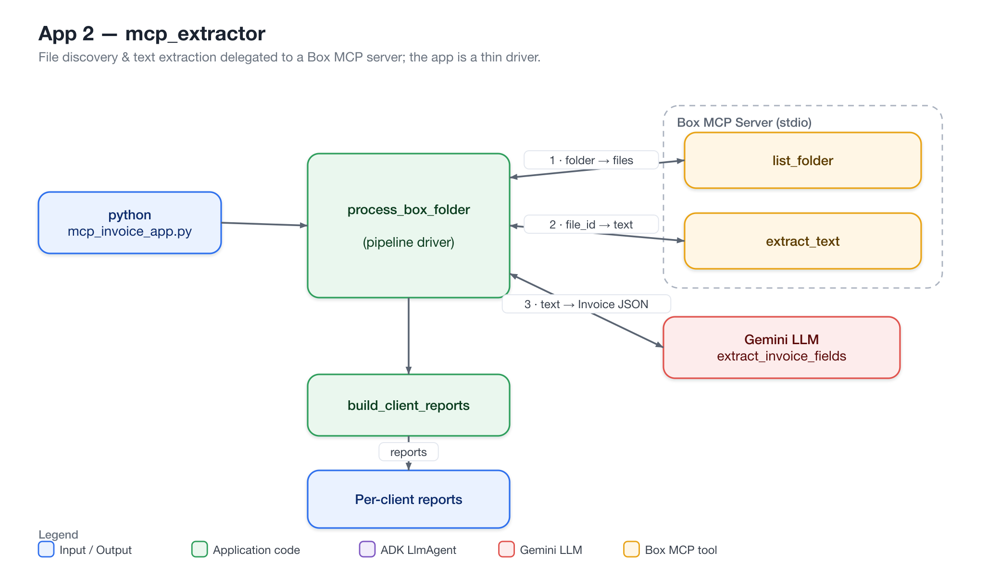

# App 2 — MCP-Compliant Invoice App

An invoice-processing app that lists and reads invoices **directly from Box
through the Box MCP server** — no manual downloads. It extracts **client name,
total amount, and purchased products** from each invoice and writes a
**per-client summary report**.

This is the same goal as App 1, but file discovery and text extraction are
delegated to the Box MCP server instead of done with local code.

This folder is fully self-contained.

---

## Architecture

File discovery and text extraction are delegated to a Box MCP server over stdio,
so the app is a thin pipeline driver — no local PDF parsing or Box API code.



## Files

```
mcp_extractor/
├── mcp_invoice_app.py     # Entry point: Box folder (via MCP) -> reports
├── box_mcp_client.py      # Async MCP client for the Box MCP server
├── invoice_models.py      # Invoice / LineItem / ClientReport + aggregation
├── llm_extraction.py      # LLM field-extraction (prompt + JSON parsing)
└── requirements.txt
```

## How it works

1. `box_mcp_client.py` connects to the Box MCP server and discovers its tools.
2. `mcp_invoice_app.py` asks the server to **list files** in a Box folder and
   **extract text** from each one (no local PDF parsing).
3. `llm_extraction.py` parses that text into structured invoice fields via an LLM.
4. `invoice_models.py` aggregates everything into per-client reports.

**MCP (Model Context Protocol)** standardizes how tools/resources are exposed to
an LLM app, so this app calls the server's tools instead of writing custom Box
API or PDF-parsing code.

## Setup

```bash
pip install -r requirements.txt

export GOOGLE_API_KEY="..."                 # LLM (Gemini via google-genai)
export INVOICE_LLM_MODEL="gemini-2.5-flash"  # optional override

export BOX_DEVELOPER_TOKEN="..."
export BOX_MCP_COMMAND="box-mcp-server"      # however you launch the server
# export BOX_MCP_ARGS="--some-flag value"    # optional
```

## Run

```bash
python mcp_invoice_app.py <box_folder_id>     # "0" is the Box root folder
```

Writes `reports/report_<Client>.txt` for each client found.

## Notes

- The Box MCP tool names used here (`list_folder`, `extract_text`) are
  placeholders that depend on the server version. Call `discover_tools()` in
  `box_mcp_client.py` to see the real names and adjust the `call_tool` calls.
- The LLM is prompted to return strict JSON; `llm_extraction.py` strips code
  fences and parses it. Add validation/retries for production use.
- Generative output is non-deterministic; the same invoice may parse slightly
  differently across runs.

## Evaluation

The repo's [`evals/`](../../evals/README.md) harness measures this app's extraction
quality (json validity, schema, field accuracy, numeric tolerance, line-item
recall, hallucination rate, empty-text handling) against a golden dataset:

```bash
python evals/run_mcp_extractor_eval.py --mock   # offline smoke test (no Box/Gemini)
python evals/run_mcp_extractor_eval.py          # real run (needs Box MCP + GOOGLE_API_KEY)
python evals/report_eval_results.py
```
