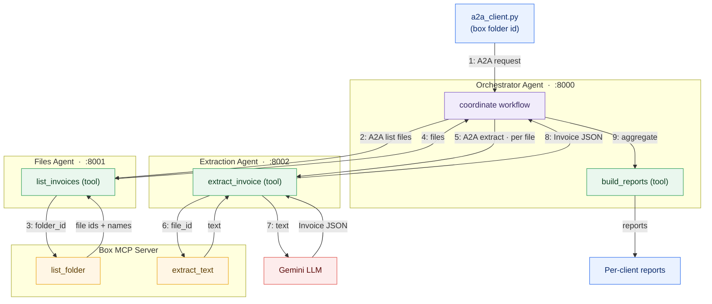

# App 3 — Multi-Agent Invoice System (MCP + A2A)

A **multi-agent** invoice-processing system. Three agents cooperate over the
**A2A (Agent2Agent) protocol**, and file access goes through the **Box MCP
server**. The system extracts **client name, total amount, and purchased
products** from invoices in a Box folder and returns a **per-client summary
report**.

Same goal as Apps 1 and 2, but the work is now split across specialized agents
that each do one job and talk to each other over A2A.

This folder is fully self-contained.

---

## Architecture

The workflow is split across three independent ADK `LlmAgent`s, each served over
A2A. The Orchestrator delegates discovery to the Files Agent and parsing to the
Extraction Agent; both reach Box through the shared MCP server. Numbers trace the
orchestration sequence.



## Files

```
multi_agent_extractor/
├── a2a_client.py                   # A2A client: sends the user's request
├── orchestrator_agent_server.py    # A2A server: coordinates sub-agents + builds reports
├── files_agent_server.py           # A2A server: lists invoices in a Box folder
├── extraction_agent_server.py      # A2A server: extracts + parses one invoice
├── box_mcp_client.py               # Async MCP client for the Box MCP server
├── invoice_models.py               # Invoice / LineItem / ClientReport + aggregation
├── llm_extraction.py               # LLM field-extraction (prompt + JSON parsing)
└── requirements.txt
```

## Architecture

```
                 ┌──────────────┐
   user ───────► │  A2A Client  │   a2a_client.py
                 └──────┬───────┘
                        │  A2A
                        ▼
              ┌──────────────────────────┐
              │     Orchestrator Agent     │  orchestrator_agent_server.py
              │     + reporting tool        │
              └───────┬──────────────────┘
              A2A     │      A2A
          ┌───────────┘      └────────────┐
          ▼                               ▼
   ┌──────────────┐               ┌──────────────────┐
   │ Files Agent  │               │ Extraction Agent │
   └──────┬───────┘               └────────┬─────────┘
files_agent_server.py            extraction_agent_server.py
          │ MCP                            │ MCP
          └───────────► Box MCP Server ◄───┘
```

- **Files Agent** — lists invoice files in a Box folder (via Box MCP).
- **Extraction Agent** — extracts a file's text (via Box MCP) and parses
  structured fields with the LLM.
- **Orchestrator** — coordinates the two sub-agents and aggregates the final
  per-client reports. Exposed as an A2A server so the client can drive it.

**A2A** standardizes inter-agent communication: each agent is its own A2A
server; the orchestrator is an A2A client of its sub-agents, and the user is an
A2A client of the orchestrator. **ADK** defines and serves each agent. **MCP**
provides the Box file tools.

## Setup

```bash
pip install -r requirements.txt

export GOOGLE_API_KEY="..."                 # LLM (Gemini via google-genai)
export INVOICE_LLM_MODEL="gemini-2.5-flash"  # optional override

export BOX_DEVELOPER_TOKEN="..."
export BOX_MCP_COMMAND="box-mcp-server"      # however you launch the server
# export BOX_MCP_ARGS="--some-flag value"    # optional
```

## Run

Start each agent in its own terminal, then run the client:

```bash
# terminal 1
python files_agent_server.py            # :8001
# terminal 2
python extraction_agent_server.py       # :8002
# terminal 3
python orchestrator_agent_server.py     # :8000
# terminal 4
python a2a_client.py <box_folder_id>
```

The client sends a natural-language request to the orchestrator, which delegates
listing to the Files Agent and extraction to the Extraction Agent, then returns
the aggregated per-client report.

## Notes

- The Box MCP tool names (`list_folder`, `extract_text`) and some ADK/A2A import
  paths are placeholders that vary by version. Discover real tool names via the
  MCP client and adjust as needed.
- Default ports (8000/8001/8002) and agent URLs are configurable via environment
  variables (`ORCHESTRATOR_PORT`, `FILES_AGENT_URL`, `EXTRACTION_AGENT_URL`,
  etc.).
- Generative output is non-deterministic; the same invoice may parse slightly
  differently across runs.

## Evaluation

The repo's [`evals/`](../../evals/README.md) harness evaluates this multi-agent
system at two levels — each agent (Files / Extraction) on its own work function,
and the full orchestrated workflow end-to-end — plus trace-based delegation and
per-client report correctness:

```bash
python evals/run_multi_agent_eval.py --mode mock        # offline smoke test
python evals/run_multi_agent_eval.py --mode component   # per-agent (needs google-adk + Box + Gemini)
python evals/run_multi_agent_eval.py --mode e2e --folder-id <id>   # full A2A workflow (all 3 servers up)
python evals/report_eval_results.py
```
